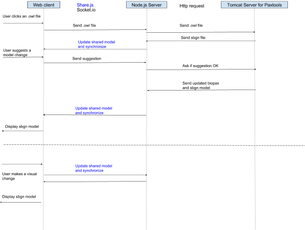
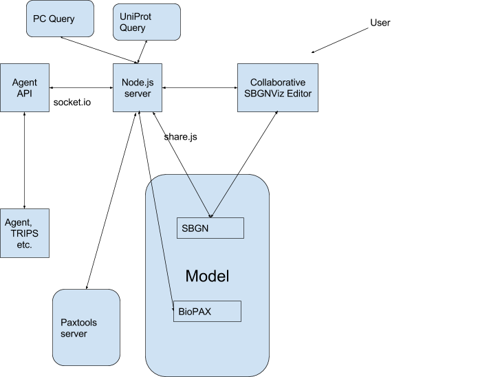
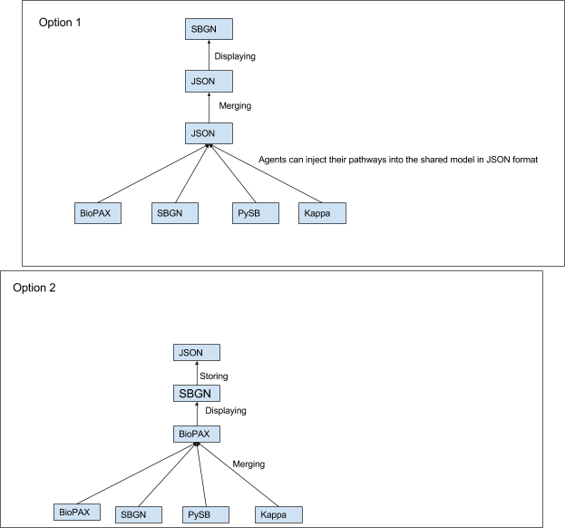

## 

# SBGNViz Collaborative Editor User Guide

The editor allows human curators and computer agents to work on the same pathway model, and communicate through text and images. On the server side, we have an application server that keeps the model, handles communication across clients, and performs operational transformation. Model visualization and editing are handled on the client side. The editor visualizes information about cellular processes and pathways in SBGN (Systems Biology Graphical Notation) format. It allows for automatic graph layout, editing and highlighting facilities.

## Installation

Install node.js, mongodb and redis servers first.

Node:

>curl -sL [https://deb.nodesource.com/setup_0.12](https://www.google.com/url?q=https://deb.nodesource.com/setup_0.12&sa=D&ust=1473277272610000&usg=AFQjCNHvK51-MOEyt5XJM5ju9Xm8q9_1iA) | sudo -E bash -

>sudo apt-get install -y nodejs

Redis:

>sudo apt-get update

>sudo apt-get install build-essential

>sudo apt-get install tcl8.5

wget [http://download.redis.io/releases/redis-stable.tar.gz](https://www.google.com/url?q=http://download.redis.io/releases/redis-stable.tar.gz&sa=D&ust=1473277272614000&usg=AFQjCNHuP87lkYspiCPdB4JXOsdpmw_AVw)

>tar xzf redis-stable.tar.gz

>cd redis-stable

>make

Mongo:

>sudo apt-key adv --keyserver hkp://[keyserver.ubuntu.com:80](https://www.google.com/url?q=http://keyserver.ubuntu.com/&sa=D&ust=1473277272617000&usg=AFQjCNG3IFqlx2U7rG-24mbGlfK_UGeYgg) --recv EA312927

>echo "deb [http://repo.mongodb.org/apt/ubuntu](https://www.google.com/url?q=http://repo.mongodb.org/apt/ubuntu&sa=D&ust=1473277272618000&usg=AFQjCNFgAwwqIdTGH6HUbgTZzuBYRFzS3A) trusty/mongodb-org/3.2 multiverse" | sudo tee /etc/apt/sources.list.d/mongodb-org-3.2.list

>sudo apt-get update

>sudo apt-get install -y mongodb-org

If mongo does not work:

>sudo apt-get install upstart-sysv

Get project from github:

>git clone [https://github.com/fdurupinar/Sbgnviz-Collaborative-Editor.git](https://www.google.com/url?q=https://github.com/fdurupinar/Sbgnviz-Collaborative-Editor.git&sa=D&ust=1473277272622000&usg=AFQjCNGnICkgfq6MDFNKA6YIsB_cSDmTKw)

>cd Sbgnviz-Collaborative-Editor

>sudo rm -rf node_modules

>npm install

Run server:

>node server

In order to open a client:

Enter “http://localhost:3000” to the address bar of your browser.

## System Framework

## Framework Details

 

### Computer Agent API

Computer agents are connected to the node.js http server via websockets (socket.io.js). An agent is initialized with a name (string)  and a unique ID (string).

Constructor: Agent (string name, string id)

#### Public Attributes:

agentId: (string) A unique id

agentName: (string) Agent name

colorCode: A specific color to identify the agent operations. It should be a string in hsla format as: “hsla(H, S, L%, 1)”, where H (integer), S (float) and L (float) are hue, saturation and lightness values.

selectedNode: The node object on which the agent is performing operations. It has attributes such as position ={x:<posX>,y:<posY>}, width, height, borderWidth, borderHeight, backgroundColor, sbgnLabel, sbgnStatesAndInfos = {clazz:<className>, state = {value:<stateValue>,variable:<stateVariable>}}.

 

selectedEdge: The edge object on which the agent is performing operations. It has attributes such as cardinality, lineColor and width.

opHistory: History of operations as an array of strings in the format: “UserName (date): Command”.

chatHistory: Chat history as an array of messages.

userList: List of connected user ids.

#### Private Attributes:

room: The document id that identifies the shared model. It is the string after http:<ip>:3000/ in the server address.

socket: The web socket between the server and agent

pageDoc: The document that the shared model is stored.

#### Methods:

<table class="c49">

<tbody>

<tr class="c3">

<td class="c13" colspan="1" rowspan="1">

Name

</td>

<td class="c8" colspan="1" rowspan="1">

Function

</td>

<td class="c22" colspan="1" rowspan="1">

Parameters

</td>

<td class="c38" colspan="1" rowspan="1">

Returns

</td>

</tr>

<tr class="c3">

<td class="c13" colspan="1" rowspan="1">

connectToServer

</td>

<td class="c8" colspan="1" rowspan="1">

Connects the server and returns socket.io socket

</td>

<td class="c22" colspan="1" rowspan="1">

url, callback

</td>

<td class="c38" colspan="1" rowspan="1">

socket

</td>

</tr>

<tr class="c3">

<td class="c13" colspan="1" rowspan="1">

loadModel

</td>

<td class="c8" colspan="1" rowspan="1">

Gets the model for the current room

</td>

<td class="c22" colspan="1" rowspan="1">

callback

</td>

<td class="c38" colspan="1" rowspan="1">

</td>

</tr>

<tr class="c3">

<td class="c13" colspan="1" rowspan="1">

loadOperationHistory

</td>

<td class="c8" colspan="1" rowspan="1">

Gets history of operations from the node.js server and assigns them to opHistory

</td>

<td class="c22" colspan="1" rowspan="1">

callback

</td>

<td class="c38" colspan="1" rowspan="1">

</td>

</tr>

<tr class="c3">

<td class="c13" colspan="1" rowspan="1">

loadUserList

</td>

<td class="c8" colspan="1" rowspan="1">

Gets user list from the node.js server and assigns them to userList

</td>

<td class="c22" colspan="1" rowspan="1">

callback

</td>

<td class="c38" colspan="1" rowspan="1">

</td>

</tr>

<tr class="c3">

<td class="c13" colspan="1" rowspan="1">

loadChatHistory

</td>

<td class="c8" colspan="1" rowspan="1">

Gets history of chat messages from the node.js server and assigns them to chatHistory

</td>

<td class="c22" colspan="1" rowspan="1">

callback

</td>

<td class="c38" colspan="1" rowspan="1">

</td>

</tr>

<tr class="c3">

<td class="c13" colspan="1" rowspan="1">

getNodeList

</td>

<td class="c8" colspan="1" rowspan="1">

</td>

<td class="c22" colspan="1" rowspan="1">

callback

</td>

<td class="c38" colspan="1" rowspan="1">

The node list in the shared model as an object of node ids

</td>

</tr>

<tr class="c42">

<td class="c13" colspan="1" rowspan="1">

getLayoutProperties

</td>

<td class="c8" colspan="1" rowspan="1">

</td>

<td class="c22" colspan="1" rowspan="1">

callback

</td>

<td class="c38" colspan="1" rowspan="1">

Layout properties of the shared model as an object with attributes as:

{name: <layout name>,

 nodeRepulsion: <node repulsion value> ,

 nodeOverlap:<node overlap percentage>,

idealEdgeLength:<ideal edge length value>,

edgeElasticity:<edge elasticity value>,

nestingFactor:<nesting factor value>,

gravity:<gravity value>,

numIter:<number of iterations>,

tile:<boolean value to tile disconnected>,

animate:<boolean value>,

randomize:<boolean value>}

</td>

</tr>

<tr class="c32">

<td class="c13" colspan="1" rowspan="1">

changeName

</td>

<td class="c8" colspan="1" rowspan="1">

Sends request to the server to change agent's name

</td>

<td class="c22" colspan="1" rowspan="1">

newName

</td>

<td class="c38" colspan="1" rowspan="1">

</td>

</tr>

<tr class="c3">

<td class="c13" colspan="1" rowspan="1">

getNodeRequest

</td>

<td class="c8" colspan="1" rowspan="1">

Requests the node with <id> from the server

</td>

<td class="c22" colspan="1" rowspan="1">

id, callback

</td>

<td class="c38" colspan="1" rowspan="1">

Node with id

</td>

</tr>

<tr class="c3">

<td class="c13" colspan="1" rowspan="1">

getEdgeRequest

</td>

<td class="c8" colspan="1" rowspan="1">

Requests the edge with <id> from the server

</td>

<td class="c22" colspan="1" rowspan="1">

id, callback

</td>

<td class="c38" colspan="1" rowspan="1">

Edge with id

</td>

</tr>

<tr class="c3">

<td class="c13" colspan="1" rowspan="1">

sendMessage

</td>

<td class="c8" colspan="1" rowspan="1">

Sends chat message <comments> as a string to <targetArr> as an array of targeted user ids [{id: <id1>},..., {id: <idn>}]

</td>

<td class="c22" colspan="1" rowspan="1">

comment, targetArr, callback

</td>

<td class="c38" colspan="1" rowspan="1">

</td>

</tr>

<tr class="c3">

<td class="c13" colspan="1" rowspan="1">

listen

</td>

<td class="c8" colspan="1" rowspan="1">

Socket listener for server requests. Can get “operation”, “message”, “userList” or “imageFile” from the server.

</td>

<td class="c22" colspan="1" rowspan="1">

callback

</td>

<td class="c38" colspan="1" rowspan="1">

</td>

</tr>

<tr class="c41">

<td class="c13" colspan="1" rowspan="1">

sendRequest

</td>

<td class="c8" colspan="1" rowspan="1">

Sends an operation request to the node.js server.  Model update operations are done using this method.

</td>

<td class="c22" colspan="1" rowspan="1">

[reqName, param](#h.nhfdym5d0wpf)

</td>

<td class="c38" colspan="1" rowspan="1">

</td>

</tr>

</tbody>

</table>

##### sendRequest:

<table class="c21">

<tbody>

<tr class="c3">

<td class="c23" colspan="1" rowspan="1">

reqName

</td>

<td class="c31" colspan="1" rowspan="1">

param

</td>

</tr>

<tr class="c3">

<td class="c23" colspan="1" rowspan="1">

“agentAddImageRequest”

</td>

<td class="c31" colspan="1" rowspan="1">

{img: <image file>,

filePath: <path of image file> }

</td>

</tr>

<tr class="c3">

<td class="c23" colspan="1" rowspan="1">

"agentSetLayoutProperties"

</td>

<td class="c31" colspan="1" rowspan="1">

{name: <layout name>,

 nodeRepulsion: <node repulsion value> ,

 nodeOverlap:<node overlap percentage>,

idealEdgeLength:<ideal edge length value>,

edgeElasticity:<edge elasticity value>,

nestingFactor:<nesting factor value>,

gravity:<gravity value>,

numIter:<number of iterations>,

tile:<boolean value to tile disconnected>,

animate:<boolean value>,

randomize:<boolean value>}

</td>

</tr>

<tr class="c3">

<td class="c23" colspan="1" rowspan="1">

“agentRunLayoutRequest”

</td>

<td class="c31" colspan="1" rowspan="1">

-

</td>

</tr>

<tr class="c3">

<td class="c23" colspan="1" rowspan="1">

“agentAddNodeRequest”

</td>

<td class="c31" colspan="1" rowspan="1">

{x: <position x>,

y: <position y>,

sbgnclass: <sbgn class>}

</td>

</tr>

<tr class="c3">

<td class="c23" colspan="1" rowspan="1">

“agentAddEdgeRequest”

</td>

<td class="c31" colspan="1" rowspan="1">

{source: <source node id>,

target: <target node id>,

sbgnclass: <sbgn class>}

</td>

</tr>

<tr class="c3">

<td class="c23" colspan="1" rowspan="1">

“agentChangeNodeAttributeRequest”

</td>

<td class="c31" colspan="1" rowspan="1">

{id: <node id>,

attStr: <node attribute name in the model>

attVal:<node attribute value>}

attStr takes the following values: “sbgnclass”, “highlightColor”, “backgroundColor”, “sbgnlabel”, “borderColor”, “borderWidth”, “isMultimer”, “isCloneMarker”, “parent”, “children”, “width”, “height”, “sbgnbboxW”, “sbgnbboxH”, “sbgnStatesAndInfos”

</td>

</tr>

<tr class="c3">

<td class="c23" colspan="1" rowspan="1">

“agentChangeEdgeAttributeRequest”

</td>

<td class="c31" colspan="1" rowspan="1">

{id: <node id>,

attStr: <edge attribute name in the model>

attVal:<edge attribute value>}

attStr takes the following values: “lineColor”, “highlightColor”, “width”, “cardinality”  

</td>

</tr>

<tr class="c3">

<td class="c23" colspan="1" rowspan="1">

“agentMoveNodeRequest”

</td>

<td class="c31" colspan="1" rowspan="1">

{id: <node id>,

pos: {x:<new position x>, y: < new position y>}}

</td>

</tr>

<tr class="c3">

<td class="c23" colspan="1" rowspan="1">

“agentAddCompoundRequest”

</td>

<td class="c31" colspan="1" rowspan="1">

{type: <compound type as “complex” or “compartment”>,

selectedNodeArr: <array of node ids>}

</td>

</tr>

<tr class="c3">

<td class="c23" colspan="1" rowspan="1">

“agentMergeGraphRequest”

</td>

<td class="c31" colspan="1" rowspan="1">

{param: <graph to be added in sbgn format>}

</td>

</tr>

</tbody>

</table>

In order to set up and run an agent:

agent = new Agent(agentName, agentId);

var socket = agent.connectToServer(serverIp, function(){

//callback operations

});

socket.on('connect', function(){

   agent.loadModel(function() {

       agent.loadOperationHistory(function(){

           agent.loadChatHistory(function(){                  

//callback operations             

});

           });

       });

   agent.listen(function(){

       socket.on('operation', function(data){

          //callback operations

       });

       socket.on('message', function(data){

           //callback operations

       });

       socket.on('userList', function(data){

           //callback operations

       });

       socket.on('imageFile', function(data){

           //callback operations

       });

   });

});

An example web-based agent can be found in:

Sbgnviz-Collaborative-Editor/agent-interaction/computerAgent.html

Command History:

JSON array as:

[

     {

userName: //name of the user who gave the command

name: //name of the command

id: //id of the affected element

param: //operation parameters

         [

              {

                x: //node position x

                y: //node position y

                sbgnclass: //node sbgnclass

                source:  //edge source

                target:  //edge target

                sbgnclass: //edge sbgnclass

              }

]

date: //date of the command

   }

]

## History Manager

Each command is stored in the model as a part of command history. Command structure is as follows:

opName: set | add | delete | init

opTarget: node | edge | node group | edge group

opAttr:  id| position | sbgnclass | sbgnlabel | width | height | backgroundColor |  borderColor | borderWidth | parent | isCloneMarker | isMultimer | sbgnStatesAndInfos| source| target |lineColor | lineWidth| sbgncardinality

elId: id of the node or edge | id array of the node or edge group

elType: “node” or “edge”

param:

prevParam:

### JSON Model Structure

*   users

*   name

*   page

*   list
*   room
*   doc

*   userIds
*   history
*   undoIndex
*   Images
*   Context

*   name
*   relevance
*   confidence

*   cy  //sbgn-related

*   sampleInd //temporary
*   layoutProperties
*   nodes

*   [nodeId]

*   id
*   addedLater //to sync. node addition
*   sbgnclass
*   position
*   highlightColor
*   sbgnlabel
*   borderColor
*   borderWidth
*   backgroundColor
*   backgroundOpacity
*   isMultimer
*   isCloneMarker
*   ports
*   width
*   height
*   sbgnStatesAndInfos
*   expandCollapseStatus
*   highlightStatus
*   visibilityStatus

*   edges

*   [edgeId]

*   id
*   addedLater //to sync. edge addition
*   sbgnclass
*   source
*   target
*   portsource
*   porttarget
*   highlightColor
*   lineColor
*   width
*   bendPointPositions
*   highlightStatus
*   visibilityStatus
*   sbgnCardinality

*   py // pysb-related
*   //biopax-related

# Framework with Biopax

## 

# In development

                                   

We’re trying to set up a pipeline to display an SBGN model on screen right from the plain text written in the chat box. Two possibilities:

*   Fetch a BioPAX model directly from the REACH library.

OR:

*   Fetch first the REACH output indexcard JSON format then convert it in a BioPAX model.

Then implement:

1.  a naive “merger”, creating an SBGN model right from the indexcard JSON format. The new component appear separate from the other on screen and leave the duplicated entities as is if any.
2.  a more sophisticated one trying to really merge both the old and new components on screen if necessary, and leave the duplicated entities as is if any.
3.  a merger where all the SBGN models appear actually merged together when         possible and the entities are de-duplicated to guarantee the coherence of the resulting model.
4.  a GUI giving the user the opportunity to choose between different possible         models before any validation.

## Data Alignment

# Context Agent

## 

