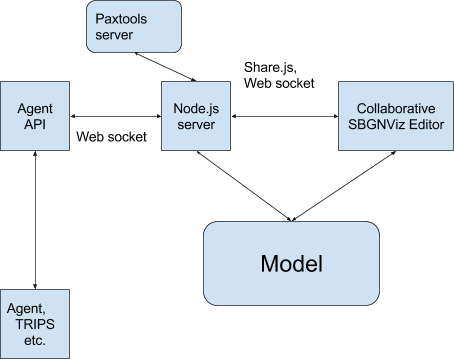

<html>

</head>
<body lang="en-US" dir="ltr">
<h1>SBGNViz Collaborative Editor User
Guide</h1>

The editor allows human curators and computer agents to work on
the same pathway model, and communicate through text and images. On
the server side, we have an application server that keeps the model,
handles communication across clients, and performs operational
transformation. Model visualization and editing are handled on the
client side. The editor visualizes information about cellular
processes and pathways in SBGN (Systems Biology Graphical Notation)
format. It allows for automatic graph layout, editing and
highlighting facilities. 

<h2 class="western">Installation</h2>

Install node.js, mongodb and redis servers first.

Node:

&gt;curl -sL <a href="https://www.google.com/url?q=https://deb.nodesource.com/setup_0.12&amp;sa=D&amp;ust=1456966704465000&amp;usg=AFQjCNGGRmt27os-aQCnnpnjDmM-dK8UTA">https://deb.nodesource.com/setup_0.12</a>&nbsp;|
sudo -E bash -

&gt;sudo apt-get install -y nodejs

Redis:

&gt;sudo apt-get update

&gt;sudo apt-get install build-essential

&gt;sudo apt-get install tcl8.5

&gt;wget <a href="https://www.google.com/url?q=http://download.redis.io/releases/redis-stable.tar.gz&amp;sa=D&amp;ust=1456966704468000&amp;usg=AFQjCNGwsqVTEvOoDXFJXUPfOp5HAjVP5w">http://download.redis.io/releases/redis-stable.tar.gz</a>

&gt;tar xzf redis-stable.tar.gz

&gt;cd redis-stable

&gt;make

Mongo:

&gt;sudo apt-key adv --keyserver
hkp://<a href="https://www.google.com/url?q=http://keyserver.ubuntu.com/&amp;sa=D&amp;ust=1456966704470000&amp;usg=AFQjCNGvhIICtXNVxHKClfjeGof6XYMC4A">keyserver.ubuntu.com:80</a>&nbsp;--recv
EA312927

&gt;echo &quot;deb
<a href="https://www.google.com/url?q=http://repo.mongodb.org/apt/ubuntu&amp;sa=D&amp;ust=1456966704471000&amp;usg=AFQjCNEKWJoH8yIBAFiMQ-MCWVrWwM09GA">http://repo.mongodb.org/apt/ubuntu</a>&nbsp;trusty/mongodb-org/3.2
multiverse&quot; | sudo tee
/etc/apt/sources.list.d/mongodb-org-3.2.list

&gt;sudo apt-get update

&gt;sudo apt-get install -y mongodb-org

If mongo does not work:

&gt;sudo apt-get install upstart-sysv

Get project from github:

&gt;git clone
<a href="https://www.google.com/url?q=https://github.com/fdurupinar/Sbgnviz-Collaborative-Editor.git&amp;sa=D&amp;ust=1456966704473000&amp;usg=AFQjCNEHA0UHM1vmyy5RgBaDtjAfIfIBDg">https://github.com/fdurupinar/Sbgnviz-Collaborative-Editor.git</a>

&gt;cd Sbgnviz-Collaborative-Editor

&gt;sudo rm -rf node_modules

&gt;npm install

Run server:

&gt;node server

In order to open a client:

Enter “http://localhost:3000” to the address bar of your
browser. 

<h2 class="western">System Framework</h2>

<h2 class="western">Framework Details</h2>

&nbsp;

<h3 class="western">Computer Agent API</h3>

Computer agents are connected to the node.js http server via
websockets (socket.io.js). An agent is initialized with a name
(string) &nbsp;and a unique ID (string).

Constructor: Agent (string name, string id)

<h4 class="western">Public Attributes:</h4>

agentId: (string) A unique id

agentName: (string) Agent name

colorCode: A specific color in hex format to identify the agent operations.

selectedNode: The node object on which the agent is performing
operations. It has attributes such as position ={x:&lt;posX&gt;,y:&lt;posY&gt;},
width, height, borderWidth, borderHeight, backgroundColor, sbgnLabel,
sbgnStatesAndInfos = {clazz:&lt;className&gt;, state =
{value:&lt;stateValue&gt;,variable:&lt;stateVariable&gt;}}.

&nbsp;

selectedEdge: The edge object on which the agent is performing
operations. It has attributes such as cardinality, lineColor and
width.

opHistory: History of operations as an array of strings in the
format: “UserName&nbsp;(date):&nbsp;Command”.

chatHistory: Chat history as an array of messages.

userList: List of connected user ids.

<h4 class="western">Private Attributes:</h4>

room: The document id that identifies the shared model. It is the
string after http:&lt;ip&gt;:3000/ in the server address.

socket: The web socket between the server and agent

pageDoc: The document that the shared model is stored.

<h4 class="western">Methods:</h4>
<table cellpadding="2" cellspacing="2">
	<tr>
		<td style="border: none; padding: 0in">
			
Name

		</td>
		<td style="border: none; padding: 0in">
			
Function

		</td>
		<td style="border: none; padding: 0in">
			
Parameters

		</td>
		<td style="border: none; padding: 0in">
			
Returns

		</td>
	</tr>
	<tr>
		<td style="border: none; padding: 0in">
			
connectToServer

		</td>
		<td style="border: none; padding: 0in">
			
Connects the server and returns socket.io socket

		</td>
		<td style="border: none; padding: 0in">
			
url, callback

		</td>
		<td style="border: none; padding: 0in">
			
socket

		</td>
	</tr>
	<tr>
		<td style="border: none; padding: 0in">
			
loadModel

		</td>
		<td style="border: none; padding: 0in">
			
Gets the model for the current room

		</td>
		<td style="border: none; padding: 0in">
			
callback

		</td>
		<td style="border: none; padding: 0in"></td>
	</tr>
	<tr>
		<td style="border: none; padding: 0in">
			
loadOperationHistory

		</td>
		<td style="border: none; padding: 0in">
			
Gets history of operations from the node.js server and assigns
			them to opHistory

		</td>
		<td style="border: none; padding: 0in">
			
callback

		</td>
		<td style="border: none; padding: 0in"></td>
	</tr>
	<tr>
		<td style="border: none; padding: 0in">
			
loadUserList

		</td>
		<td style="border: none; padding: 0in">
			
Gets user list from the node.js server and assigns them to
			userList

		</td>
		<td style="border: none; padding: 0in">
			
callback

		</td>
		<td style="border: none; padding: 0in"></td>
	</tr>
	<tr>
		<td style="border: none; padding: 0in">
			
loadChatHistory

		</td>
		<td style="border: none; padding: 0in">
			
Gets history of chat messages from the node.js server and
			assigns them to chatHistory

		</td>
		<td style="border: none; padding: 0in">
			
callback

		</td>
		<td style="border: none; padding: 0in"></td>
	</tr>
	<tr>
		<td style="border: none; padding: 0in">
			
getNodeList

		</td>
		<td style="border: none; padding: 0in"></td>
		<td style="border: none; padding: 0in">
			
callback

		</td>
		<td style="border: none; padding: 0in">
			
The node list in the shared model as an object of node ids

		</td>
	</tr>
	<tr>
		<td style="border: none; padding: 0in">
			
getLayoutProperties

		</td>
		<td style="border: none; padding: 0in"></td>
		<td style="border: none; padding: 0in">
			
callback

		</td>
		<td style="border: none; padding: 0in">
			
Layout properties of the shared model as an object with
			attributes as: 
			

			
{name: &lt;layout name&gt;,

			
&nbsp;nodeRepulsion: &lt;node repulsion value&gt; ,

			
&nbsp;nodeOverlap:&lt;node overlap percentage&gt;, 
			

			
idealEdgeLength:&lt;ideal edge length value&gt;, 
			

			
edgeElasticity:&lt;edge elasticity value&gt;, 
			

			
nestingFactor:&lt;nesting factor value&gt;, 
			

			
gravity:&lt;gravity value&gt;, 
			

			
numIter:&lt;number of iterations&gt;,

			
tile:&lt;boolean value to tile disconnected&gt;, 
			

			
animate:&lt;boolean value&gt;, 
			

			
randomize:&lt;boolean value&gt;} 
			

		</td>
	</tr>
	<tr>
		<td style="border: none; padding: 0in">
			
changeName

		</td>
		<td style="border: none; padding: 0in">
			
Sends request to the server to change agent's name

		</td>
		<td style="border: none; padding: 0in">
			
newName

		</td>
		<td style="border: none; padding: 0in"></td>
	</tr>
	<tr>
		<td style="border: none; padding: 0in">
			
getNodeRequest

		</td>
		<td style="border: none; padding: 0in">
			
Requests the node with &lt;id&gt; from the server

		</td>
		<td style="border: none; padding: 0in">
			
id, callback

		</td>
		<td style="border: none; padding: 0in">
			
Node with id

		</td>
	</tr>
	<tr>
		<td style="border: none; padding: 0in">
			
getEdgeRequest

		</td>
		<td style="border: none; padding: 0in">
			
Requests the edge with &lt;id&gt; from the server

		</td>
		<td style="border: none; padding: 0in">
			
id, callback

		</td>
		<td style="border: none; padding: 0in">
			
Edge with id

		</td>
	</tr>
	<tr>
		<td style="border: none; padding: 0in">
			
sendMessage

		</td>
		<td style="border: none; padding: 0in">
			
Sends chat message &lt;comments&gt; as a string to &lt;targetArr&gt;
			as an array of targeted user ids [{id: &lt;id1&gt;},..., {id:
			&lt;idn&gt;}]

		</td>
		<td style="border: none; padding: 0in">
			
comment, targetArr, callback

		</td>
		<td style="border: none; padding: 0in"></td>
	</tr>
	<tr>
		<td style="border: none; padding: 0in">
			
listen

		</td>
		<td style="border: none; padding: 0in">
			
Socket listener for server requests. Can get “operation”,
			“message”, “userList” or “imageFile” from the server.

		</td>
		<td style="border: none; padding: 0in">
			
callback

		</td>
		<td style="border: none; padding: 0in"></td>
	</tr>
	<tr>
		<td style="border: none; padding: 0in">
			
sendRequest

		</td>
		<td style="border: none; padding: 0in">
			
Sends an operation request to the node.js server. &nbsp;Model
			update operations are done using this method.

		</td>
		<td style="border: none; padding: 0in">
			
<a href="#h.nhfdym5d0wpf">reqName, param</a>

		</td>
		<td style="border: none; padding: 0in"></td>
	</tr>
</table>
<h5 class="western">sendRequest:</h5>
<table width="1674" cellpadding="2" cellspacing="0">
	<col width="212">
	<col width="1454">
	<tr>
		<td width="212" style="border: none; padding: 0in">
			
reqName

		</td>
		<td width="1454" style="border: none; padding: 0in">
			
param

		</td>
	</tr>
	<tr>
		<td width="212" style="border: none; padding: 0in">
			
“agentAddImageRequest”

		</td>
		<td width="1454" style="border: none; padding: 0in">
			
{img: &lt;image file&gt;, 
			

			
filePath: &lt;path of image file&gt; } 
			

		</td>
	</tr>
	<tr>
		<td width="212" style="border: none; padding: 0in">
			
&quot;agentSetLayoutProperties&quot;

		</td>
		<td width="1454" style="border: none; padding: 0in">
			
param: {name: &lt;layout name&gt;,

			
&nbsp;nodeRepulsion: &lt;node repulsion value&gt; ,

			
&nbsp;nodeOverlap:&lt;node overlap percentage&gt;, 
			

			
idealEdgeLength:&lt;ideal edge length value&gt;, 
			

			
edgeElasticity:&lt;edge elasticity value&gt;, 
			

			
nestingFactor:&lt;nesting factor value&gt;, 
			

			
gravity:&lt;gravity value&gt;, 
			

			
numIter:&lt;number of iterations&gt;,

			
tile:&lt;boolean value to tile disconnected&gt;, 
			

			
animate:&lt;boolean value&gt;, 
			

			
randomize:&lt;boolean value&gt;}}

		</td>
	</tr>
	<tr>
		<td width="212" style="border: none; padding: 0in">
			
“agentRunLayoutRequest”

		</td>
		<td width="1454" style="border: none; padding: 0in">
			
{param:null}

		</td>
	</tr>
	<tr>
		<td width="212" style="border: none; padding: 0in">
			
“agentAddNodeRequest”

		</td>
		<td width="1454" style="border: none; padding: 0in">
			
param: {x: &lt;position x&gt;, 
			

			
y: &lt;position y&gt;, 
			

			
sbgnclass: &lt;sbgn class&gt;}}

		</td>
	</tr>
	<tr>
		<td width="212" style="border: none; padding: 0in">
			
“agentAddEdgeRequest”

		</td>
		<td width="1454" style="border: none; padding: 0in">
			
{id: &lt;source&gt; - &lt;target&gt; - &lt;sbgnclass&gt;,

			
param: {source: &lt;source node id&gt;, 
			

			
target: &lt;target node id&gt;, 
			

			
sbgnclass: &lt;sbgn class&gt;}}

		</td>
	</tr>
	<tr>
		<td width="212" style="border: none; padding: 0in">
			
“agentChangeNodeAttributeRequest”

		</td>
		<td width="1454" style="border: none; padding: 0in">
			
{id: &lt;node id&gt;, 
			

			
attStr: &lt;node attribute name in the model&gt;

			
attVal:&lt;node attribute value&gt;}

			
attStr takes the following values: “sbgnclass”,
			“highlightColor”, “backgroundColor”, “sbgnlabel”,
			“borderColor”, “borderWidth”, “isMultimer”,
			“isCloneMarker”, “parent”, “children”, “width”,
			“height”,
			“sbgnStatesAndInfos” 
			

		</td>
	</tr>
	<tr>
		<td width="212" style="border: none; padding: 0in">
			
“agentChangeEdgeAttributeRequest”

		</td>
		<td width="1454" style="border: none; padding: 0in">
			
{id: &lt;node id&gt;, 
			

			
attStr: &lt;edge attribute name in the model&gt;

			
attVal:&lt;edge attribute value&gt;}

			
attStr takes the following values: “lineColor”,
			“highlightColor”, “width”, “cardinality” &nbsp;

		</td>
	</tr>
	<tr>
		<td width="212" style="border: none; padding: 0in">
			
“agentMoveNodeRequest”

		</td>
		<td width="1454" style="border: none; padding: 0in">
			
{id: &lt;node id&gt;, 
			

			
pos: {x:&lt;new position x&gt;, y: &lt; new position y&gt;}}

		</td>
	</tr>
	<tr>
		<td width="212" style="border: none; padding: 0in">
			
“agentAddCompoundRequest”

		</td>
		<td width="1454" style="border: none; padding: 0in">
			
{type: &lt;compound type as “complex” or “compartment”&gt;,
						

			
selectedNodeArr: &lt;array of node ids&gt;}

		</td>
	</tr>
	<tr>
		<td width="212" style="border: none; padding: 0in">
			
“agentLoadFileRequest”

		</td>
		<td width="1454" style="border: none; padding: 0in">
			
{param: &lt;file content as text&gt;}

		</td>
	</tr>
	<tr>
		<td width="212" style="border: none; padding: 0in">
			
“agentNewFileRequest”

		</td>
		<td width="1454" style="border: none; padding: 0in">
			
{param:null}

		</td>
	</tr>
	<tr>
        <td width="212" style="border: none; padding: 0in">
            
“agentActiveRoomsRequest”

        </td>
        <td width="1454" style="border: none; padding: 0in">
            
{param:null}

        </td>
    </tr>
</table>

In order to set up and run an agent:

agent = new Agent(agentName, agentId);

var socket = agent.connectToServer(serverIp, function(){

//callback operations

});

socket.on('connect', function(){

&nbsp; &nbsp;agent.loadModel(function() {

&nbsp; &nbsp; &nbsp; &nbsp;agent.loadOperationHistory(function(){

&nbsp; &nbsp; &nbsp; &nbsp; &nbsp;
&nbsp;agent.loadChatHistory(function(){ &nbsp; &nbsp; &nbsp; &nbsp; &nbsp;
&nbsp; &nbsp; &nbsp; &nbsp; 

//callback operations&nbsp; &nbsp; &nbsp; &nbsp; &nbsp; &nbsp; &nbsp;

});

&nbsp; &nbsp; &nbsp; &nbsp; &nbsp; &nbsp;});

&nbsp; &nbsp; &nbsp; &nbsp;});

&nbsp; &nbsp;agent.listen(function(){

&nbsp; &nbsp; &nbsp; &nbsp;socket.on('operation', function(data){

&nbsp; &nbsp; &nbsp; &nbsp; &nbsp; //callback operations

&nbsp; &nbsp; &nbsp; &nbsp;});

&nbsp; &nbsp; &nbsp; &nbsp;socket.on('message', function(data){

&nbsp; &nbsp; &nbsp; &nbsp; &nbsp; &nbsp;//callback operations

&nbsp; &nbsp; &nbsp; &nbsp;});

&nbsp; &nbsp; &nbsp; &nbsp;socket.on('userList', function(data){

&nbsp; &nbsp; &nbsp; &nbsp; &nbsp; &nbsp;//callback operations

&nbsp; &nbsp; &nbsp; &nbsp;});

&nbsp; &nbsp; &nbsp; &nbsp;socket.on('imageFile', function(data){

&nbsp; &nbsp; &nbsp; &nbsp; &nbsp; &nbsp;//callback operations

&nbsp; &nbsp; &nbsp; &nbsp;});

&nbsp; &nbsp;});

});

Command History:

JSON array as:

[

&nbsp;{

&nbsp; &nbsp;userName: //name of the user who gave the command

&nbsp; &nbsp;date: //date and time of the command

&nbsp; &nbsp;opName: //name of the operation

&nbsp; &nbsp;elId: //id of the affected element

&nbsp; &nbsp;param: //operation parameters

&nbsp; &nbsp;[

&nbsp; &nbsp; &nbsp;{

&nbsp; &nbsp; &nbsp; &nbsp;x: //node position x

&nbsp; &nbsp; &nbsp; &nbsp;y: //node position y

&nbsp; &nbsp; &nbsp; &nbsp;sbgnclass: //node sbgnclass

&nbsp; &nbsp; &nbsp; &nbsp;source:  //edge source

&nbsp; &nbsp; &nbsp; &nbsp;target:  //edge target

&nbsp; &nbsp; &nbsp; &nbsp;sbgnclass: //edge sbgnclass

&nbsp; &nbsp; &nbsp;}

&nbsp; &nbsp;]

&nbsp;}

]

</body>
</html>